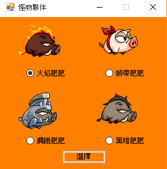
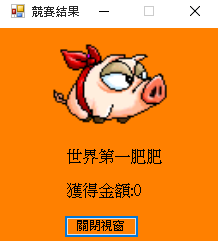

#### 程式說明
使用C# WinForm開發，利用多表單來實作，玩家可選擇人物頭像並且下注籌碼選取怪物，來進行怪物競賽+拉霸機的博弈小遊戲。

#### 執行結果
#### 主畫面

#### 頭像

#### 怪物夥伴

#### 競賽

#### 競賽結果

#### 拉霸機

#### 圖片素材皆為網路上所下載使用，此為純學術研究，非營利之目的，若有違反著作權，請Email私密告之，謝謝!
